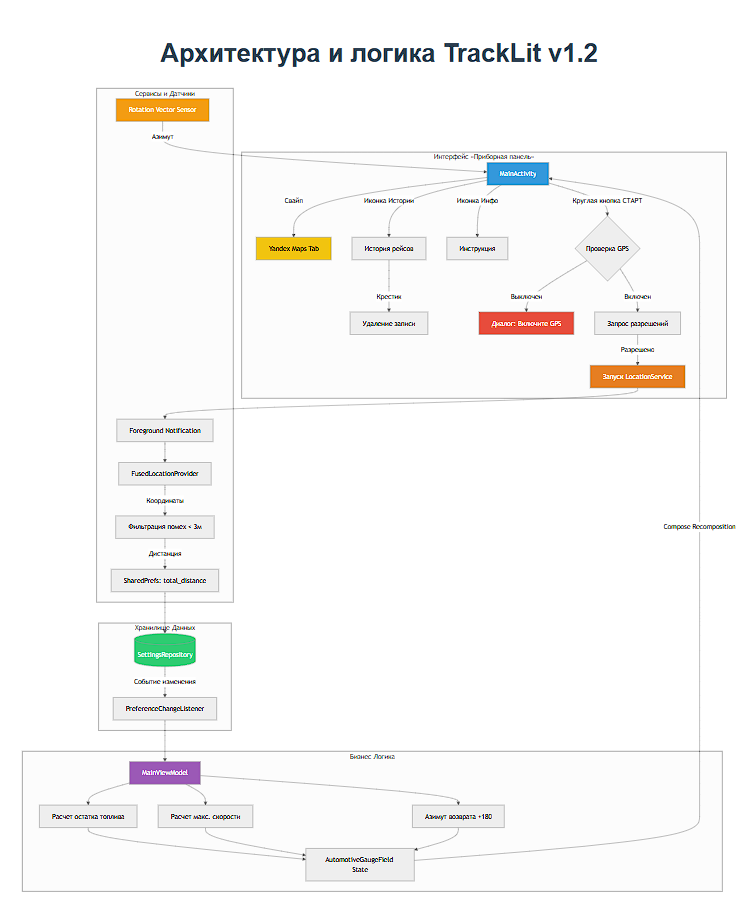

# Приложение для сбора данных транспортных средств.

    <h1>Архитектура и логика TrackLit v1.6</h1>
    
Профессиональный GPS-трекер с глубоким анализом расхода топлива и детализацией рейсов.

    <ul>
        <li>✅ Точный одометр (порог 1м)</li>
        <li>✅ Разделение Город/Межгород (порог 40 км/ч)</li>
        <li>✅ Учет спецоборудования (9л/ч) и прогрева (4.5л)</li>
        <li>✅ Редактируемая JSON-история</li>
        <li>✅ Winter Edition UI</li>
    </ul>
    

<footer>
    
&copy; 2026 TrackLit Project.

</footer>

