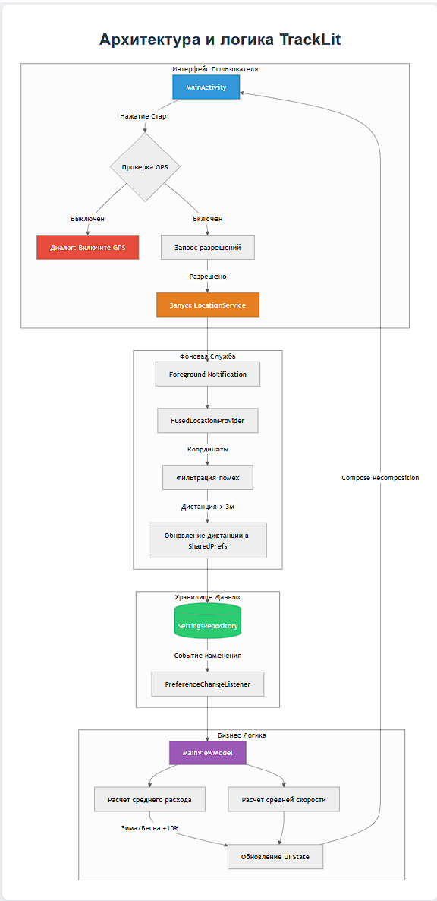

# Приложение для сбора данных транспортных средств.

 <h1>Документация приложения TrackLit</h1>
 <h1>Проект TrackLit</h1>
    
Интеллектуальный GPS-трекер для учета поездок и топлива

    
Это техническое описание архитектуры, классов и методов Android-приложения для учета пробега и расхода топлива.

    <h2>MainActivity</h2>
    UI Layer
    
Центральная Activity приложения. Управляет жизненным циклом UI (Jetpack Compose), запрашивает разрешения и контролирует запуск/остановку служб.

    <table>
        <tr><th>Метод</th><th>Описание</th></tr>
        <tr><td class="method-name">onCreate()</td><td>Инициализирует UI, регистрирует слушателей настроек и проверяет состояние GPS.</td></tr>
        <tr><td class="method-name">onStartClicked()</td><td>Проверяет GPS и разрешения (включая фоновые), затем инициирует запуск рейса.</td></tr>
        <tr><td class="method-name">startTripService()</td><td>Запускает Foreground Service для фонового отслеживания.</td></tr>
        <tr><td class="method-name">onStopClicked()</td><td>Останавливает службу и сохраняет финальные данные через ViewModel.</td></tr>
        <tr><td class="method-name">showGpsDisabledDialog()</td><td>Отображает критическое окно с требованием включить GPS.</td></tr>
        <tr><td class="method-name">showRationaleDialog()</td><td>Показывает пользователю обоснование необходимости разрешений на геолокацию.</td></tr>
    </table>

    <h2>MainViewModel</h2>
    Business Logic Layer
    
Обрабатывает все вычисления, хранит состояние UI и синхронизирует данные между экраном и репозиторием.

    <table>
        <tr><th>Метод</th><th>Описание</th></tr>
        <tr><td class="method-name">loadFields()</td><td>Загружает сохраненные значения одометра и топлива из памяти при старте.</td></tr>
        <tr><td class="method-name">calculateRemainingFuel()</td><td>Рассчитывает остаток топлива с учетом пройденного пути и сезонных коэффициентов (+10%).</td></tr>
        <tr><td class="method-name">calculateAverageSpeed()</td><td>Вычисляет среднюю скорость на основе времени старта и пройденного расстояния.</td></tr>
        <tr><td class="method-name">onFieldChange()</td><td>Валидирует ввод пользователя (десятичные числа) и сохраняет их в репозиторий.</td></tr>
        <tr><td class="method-name">onStartTrip()</td><td>Сбрасывает текущий пробег и фиксирует время начала рейса.</td></tr>
        <tr><td class="method-name">refreshDistance()</td><td>Обновляет UI-поля на основе актуальных данных от GPS-службы.</td></tr>
    </table>

    <h2>LocationService</h2>
    Background Layer
    
Foreground Service, который работает в фоне. Получает данные от GPS-провайдера и обновляет общее расстояние поездки.

    <table>
        <tr><th>Метод</th><th>Описание</th></tr>
        <tr><td class="method-name">onLocationResult()</td><td>Обрабатывает новые координаты, фильтрует GPS-помехи и суммирует дистанцию.</td></tr>
        <tr><td class="method-name">startLocationUpdates()</td><td>Настраивает параметры запроса GPS (интервал, точность) и запускает прослушивание.</td></tr>
        <tr><td class="method-name">onStartCommand()</td><td>Создает уведомление в шторке и переводит службу в режим Foreground.</td></tr>
    </table>

    <h2>SettingsRepository</h2>
    Data Layer
    
Обеспечивает постоянное хранение данных приложения с использованием SharedPreferences.

    <table>
        <tr><th>Метод</th><th>Описание</th></tr>
        <tr><td class="method-name">saveTotalDistance()</td><td>Записывает накопленный пробег текущей поездки.</td></tr>
        <tr><td class="method-name">saveFieldValue()</td><td>Сохраняет значения конкретных полей (спидометр, остаток в баке).</td></tr>
        <tr><td class="method-name">getStartTime()</td><td>Возвращает метку времени начала текущего рейса.</td></tr>
        <tr><td class="method-name">saveCurrentSpeed()</td><td>Кэширует последнюю мгновенную скорость для UI.</td></tr>
    </table>

    <h1>Архитектура и логика TrackLit</h1>
    

<footer>
    
&copy; 2026 TrackLit Project.

</footer>

